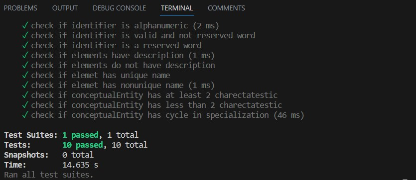

# UDDL Validation and Unit Tests for Validation Functions

## Description

This pull request aims to add the following validation rules to the AST node of UDDL.

  Context UddlElement:                               
    1. The name of an Element is a valid identifier.
    2. The following elements have a non-empty description:
       - Observable
       - Unit
       - Landmark
       - ReferencePoint
       - MeasurementSystem
       - MeasurementSystemAxis
       - CoordinateSystem
       - CoordinateSystemAxis
       - MeasurementSystemConversion
       - Boolean
       - Character
       - Numeric
       - Integer
       - Natural
       - NonNegativeReal
       - Real
       - String

  Context DataModel:
    1. Every UddlElement in an DataModel has a unique name.
       Note: This is equivalent constraint to hasUniqueName. 
	  Original constraint modified to work with Kepler
    2. A DataModel's name is not an IDL reserved word.
  
  Context ConceptualEntity:
    1. An conceptualEntity must have at least two charectaristic.
    2. An ConceptualEntity is not a specialization of itself.

## Testing

- For testing the validation function of an ast node, need to define some dummy objects replicating the property of the ast node. So created a file that will contain all the dummay objects.
- To avoid complications, helper mathods are created, which will only take the perticular property of the validating node, to add validation. And the test has been done on the helper methods.

## Additional node
Multiple validation rules might be needed for a single property of an AST node. For example, for the name property of every UddlElement, we need to check if the name is a valid identifier and not a reserved word. Instead of applying the rules in separate functions, a single function has been added to avoid unexpected results.